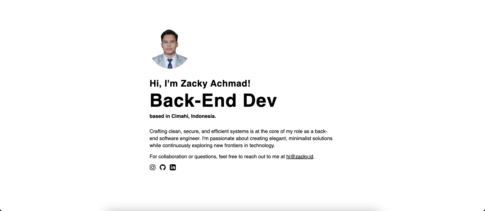

# Personal Card Website

This is a one-page personal card website created using Tailwind CSS. The website displays basic information such as name, contact details, and a brief description.

<details>
  <summary>
  Preview
  </summary>
  
</details>

## Features

- Basic contact information
- Responsive design and accessibility
- Easy to customize with Tailwind CSS
- SEO friendly and accessible

## Technologies Used

- HTML
- Tailwind CSS

## Installation

1. Clone this repository:
   ```bash
   git clone https://github.com/zckyachmd/personal-card-website.git
   ```
2. Navigate to the project folder:
   ```bash
   cd personal-card-website
   ```
3. Open the `index.html` file in your browser to view the website.

## Customization

1. Edit the `index.html` file to change the contact information and description.
2. To modify the styles, you can use the `tailwind.config.js` file.
3. To customize the appearance of the card, you can use the `src/main.css` file.

## License

This project is open source and available under the [MIT License](LICENSE).
